Getting Started
++++++++++++++++++++++++++++++++++

General Help
============================

Registering an Account
-------------------------
Registering an account on the Global forum board is typically a simple and straight forward procedure. 	 

After clicking the Register link, the terms and conditions of registering will be displayed, which you must accept to proceed. You will receive an e-mail in which the next steps required for your account activation are outlined.

Beyond accepting the terms and conditions, you need to fill out some important details such as selecting a username, entering your e-mail address and desired password. You can also select your timezone and language.

.. image:: images/get_started/registering.jpeg

If you see in the form where you can specify your username, password etc. a graphic with some odd-looking characters, then you are seeing the so-called Visual Confirmation. Simply enter the characters you see into the Confirmation code field and proceed with the registration. If you cannot understand the code, refresh the page to get a new code.

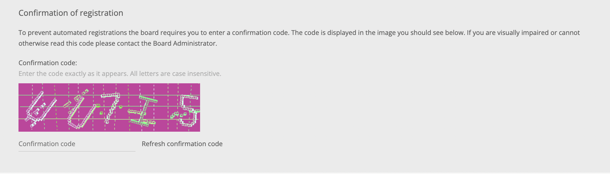

Once you have completed all of the fields on the registration page, clicking the Submit button will complete the process. If you wish to clear all fields, clicking the Reset button will do this for you. After clicking Submit, you will be advised of your next step. In most cases, you will be sent an e-mail to the address you specified with a link to finalise the registration. Other options also include being able to login immediately (i.e. there are no further actions for the registration process) or waiting until an administrator reviews your registration and accepts it, in which case you will be notified by e-mail. 

Profile
---------------------
Users may sometimes have content in their forum profile that requires that you either update it or delete it. If you don't want to change a field, leave it blank.

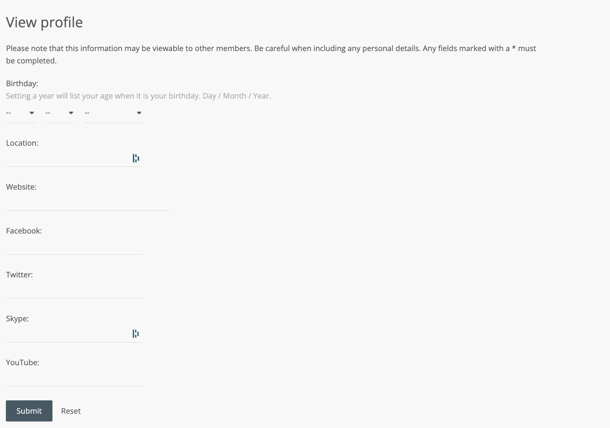

The following are the profile fields that you can change:	

* Website can have any alphanumeric characters and symbols, but must have the protocol included (ex. http://www.example.com).
* Location can have any alphanumeric characters and symbols.
* Occupation can have any alphanumeric characters and symbols.
* Interests can have any alphanumeric characters and symbols.
* Birthday can be set with three different drop-down selection boxes: Day:, Month:, and Year:, respectively. Setting a year will list the user's age when it is his or her birthday. 

Notification
---------------------
Notifications alert the user to events that have taken place on the board. They will appear in the Notifications menu at the top of your screen. Events include:

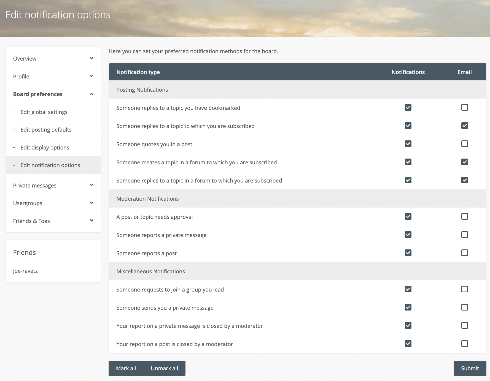

* New Private Message has arrived.
* New topic was created in a subscribed forum.
* New post was created in a subscribed topic.
* A new post is awaiting moderation.
* A post has been reported.
* Your topic/post has been approved/disapproved.
* You have been quoted in a post.

Bookmark
-------------------------
Bookmarks, much like subscriptions, are topics you've chosen to watch. However, there are two key differences:

* only individual topics may be bookmarked, and
* an e-mail will not be sent to inform you of new posts. 

To create a bookmark, visit the topic you would like to watch and click the 'Bookmark Topic' link located at the bottom of the page.

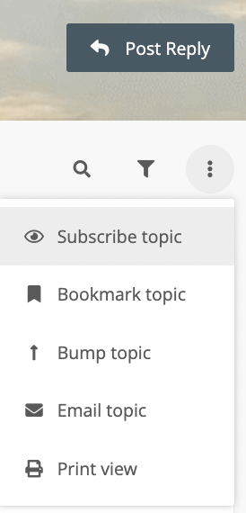

To remove a bookmark, check the box next to the bookmark you would like to remove and click the 'Remove marked bookmarks' button. 

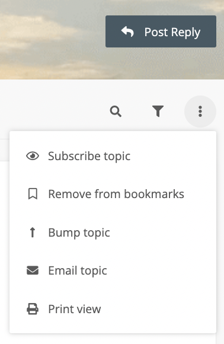

Forum
=====================================
Forum’s are sections where a post is stored. It can also have links (as Urls) to other sources. Forum’s are maintained through Rules approach set by the forum administrator. The rules on the forum gives additional control for succeful moderations. The rules are set based on the objective and purpose a forum is created.

Forum Type
=====================================

Sub forums
-----------------------------
Every forum consists of a list of pages of topics also called Sub forums. The Sub forums are created by the Forum Admin upon requests and needs. Users who are a part of the Main forum are by default part of the sub forum. 

Groups
-----------------------------
The forum page list groups for which the user is a member of, a leader of, and all other usergroups. Groups which are open for membership have a radio button allowing the user to request membership. Users may also remove themselves from groups in which they hold membership. If a user has the Can change default usergroup, they change choose which group to be their default here. The default usergroup dictates the user's username color which is shown throughout the board. Users who are designated as a group leader are able to manage the group's membership. Users can be added, removed, pending join requests can be approved or denied, and have their default usergroup changed here. 

Mastering Posting
========================================
Posting form
-----------------------------
You will be taken to the posting form when you decide to post either a new topic or reply, where you can enter your post content. 

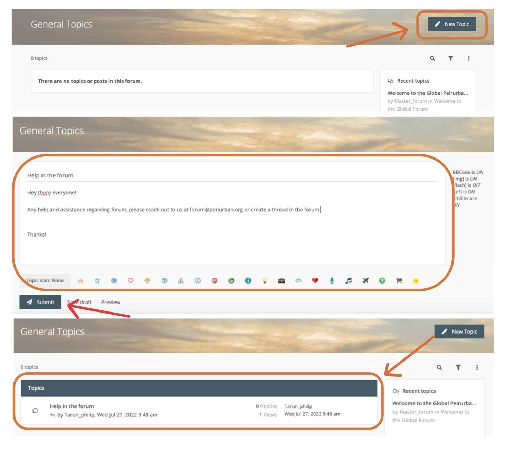

Smiles
-----------------------------
Smilies, or emoticons, are small images which can be inserted into your post to add expression emphasis. To use Smiles, certain characters are put together to get the desired output. For example, typing :) will insert |:slight_smile:| , ;) will insert |:wink:|, etc. Other smilies require the format :texthere: to display. For example, :roll: will insert |:face_with_rolling_eyes:|, and :cry: will insert |:cry:| .	

.. note:: 
 In many cases you can also select which smilie you'd like to insert by clicking its picture on the right side of the Post Content text box. When clicked, the smilie's characters will appear at the current location of the curser in the text box. 

Post Options
------------------------------
When posting either a new topic or reply, there are several post options that are available to you. You can view these options by selecting the Options tab from the section below the posting form. Depending on the permissions the board administrator has assigned to you or whether you are posting a topic or reply, these options will be different. 

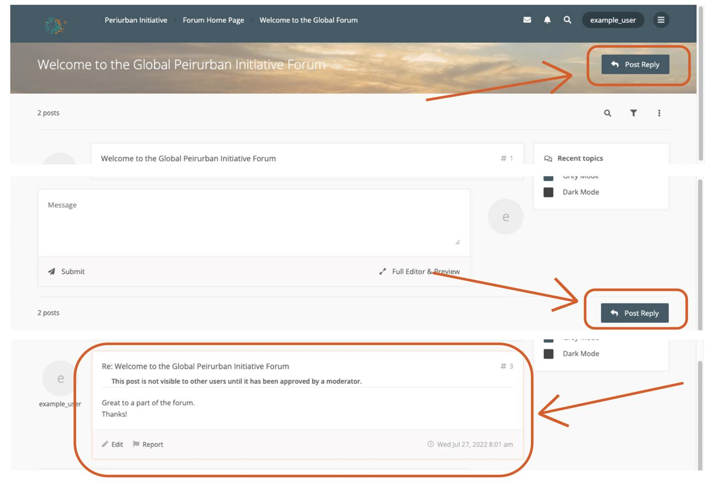

The default status of these options will depend on your Posting Defaults settings on the User Control Panel's Board Preferences page.

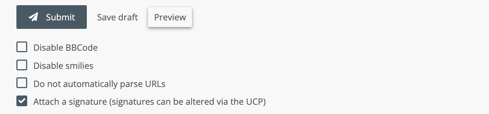

* Disable BBCode: If BBCode is enabled on the board and you are allowed to use it, this option will be available. Checking this box will not convert any BBCode in your post content into its respected output. For example, [b]Bolded text[/b] will be seen in your post as exactly [b]Bolded text[/b]. 
* Disable Smilies: If Smilies are enabled on the board and you are allowed to use them, this option will be available. Checking this box will not convert any of the smilie's characters to their respected image. For example, ;) will be seen in your post as exactly ;). 
* Do not automatically parse URLs: When entering a URL directly into your post content (in the format of http://....com or www.etc.com), by default it will be converted to a clickable string of text. However, if this box is checked when posting, these URLs will stay as a standard string of text. 
* Attach a signature (signatures can be altered via the UCP): If this box is checked, the signature you have set in your profile will be attached to the post provided signatures have been enabled by the administrator and you have the proper permissions. For more information about signatures, please see UCP Signatures.
* Send me an email when a reply is posted: If this box is checked, you will receive a notification (either by email, Jabber, etc) every time another user replies to the topic. This is called subscribing to the topic. For more information, please see UCP Subscriptions.
* Lock topic: Provided you have moderation permissions in this forum, checking this box will result in the topic being locked after your reply has been posted. At this point, no one but moderators or administrators may reply to the topic. For more information, please see Locking a topic or post.

Polls
------------------------------
Polls allow users to use a topic to vote about an idea or issue. Polls can only be created in the first post of a topic. The ability to create and vote in polls is determined by the "Polls" set by the administrator.

* Poll question - This is the idea or issue that is being voted on in the poll. This is required to start a poll.
* Poll options - These are the allowed answers to the poll question. When entering a poll option, each should be placed on a separate line of the textbox. At least two poll options are required.
* Options per user - This is the number of options each user may select when voting. When a user is allowed more than one option, a series of checkboxes replaces the radio buttons of the standard poll.
* Run poll for - This is the number of days in which users can vote in the poll. Once the time has passed, no more votes can be made and the results will be displayed.

Drafts
------------------------------
When creating a post, it can be saved or loaded using the drafts feature. If the board permissions allow drafts to be saved, then Save and Load buttons will appear on the posting page.

* Save - Saves a post as a draft. When a draft is saved, only the subject and message of the post are stored. Topic icons, attachments, etc... will be lost.
* Load - Loads a saved draft. When clicked, a listing of available drafts will appear. Click the title of the desired post to load the draft. Any information in the current post will be lost and replaced with that of the draft.

User Preferences
======================================

User Avatar
----------------------------
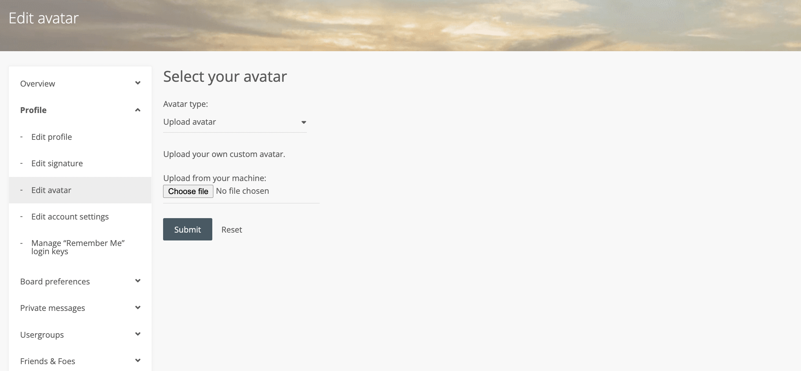

Your avatar is an image the displays with every post you make.

User Rank
----------------------------
Ranks are special titles that can be applied to forum users. It is up to the administrator to create and manage the ranks that exist on the forum board. The actual names for the ranks are completely based on the need and the purpose;

User Signature
----------------------------

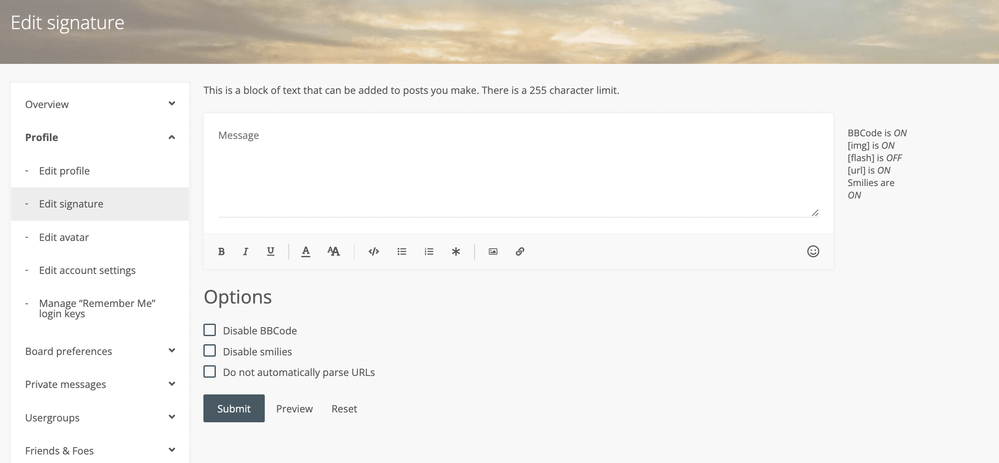

A signature is a message displayed at the end of a user's post. Signatures are set by the user. Whether or not a signature is displayed after a post is set by the user's profile settings.

Searching 
======================================

Predefined Searches
----------------------------
The Board comes with several predefined searches to easily perform certain types of queries.

* View your posts - Returns a list of topics that you have posted in, sorted by the time of the last post in the topic.
* View unanswered posts - Returns all posts which contain no replies.
* View unread posts - Returns a list of topics containing posts which you have yet to read.
* View new posts - Returns a list of topics containing posts which have been made since the last time you logged in.
* View active topics - Returns a list of topics which have been posted during the last few days. The number of days can be changed after loading the search page. 
  
Messaging
========================================

Message Dispaly
------------------------------
The Inbox is the default incoming folder, which contains a list of your recently received Private Messages.

Composing a New Message
------------------------------
The screen presented while composing a Private Message is nearly identical to the screen for creating a new post. The main difference is the addition of an address field for adding recipients.

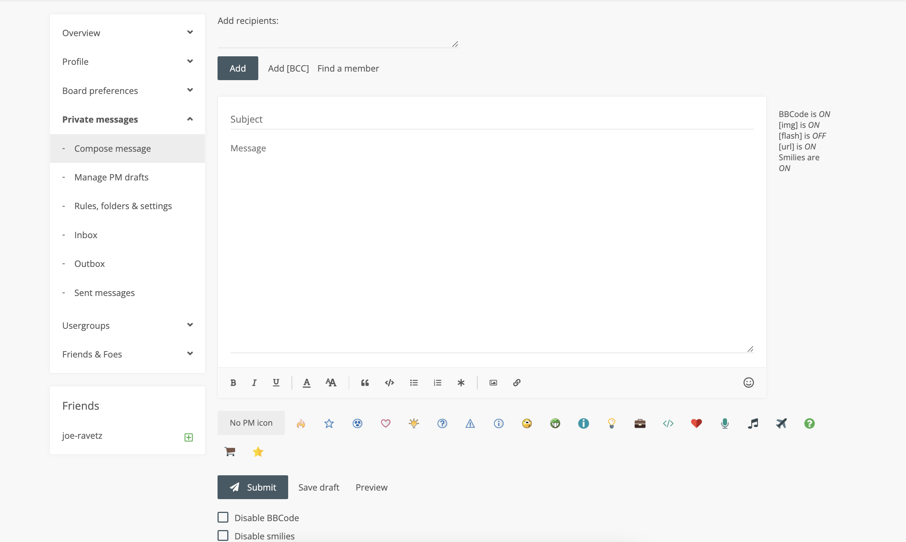

Usernames should be entered into the text area and then either the Add or Add [BCC] used to add the user to the appropriate recipient list. If you are unsure of a user's name, you can use the Find a member link to search the memberlist for the user. Place a check next to the desired user(s) in the memberlist and press Select marked to add the user to the recipient field.

Message Folder
------------------------------
Just like in your e-mail client, all private messages are stored in folders. The Inbox is your default incoming message folder. All messages you receive will appear here. 

.. image:: images/messages/inbox.png

Sent messages will appear in either the Outbox or the Sent messages folder. As long as the recipient(s) have not yet read the message, it will stay in the Outbox. As soon as someone reads the message it will be archived to the Sent messages folder. If the administrator allows it, you can edit messages after sending them as long as they are in the Outbox and the recipients have not yet read them. 

Each folder, including Sent messages and Outbox, can hold a board-defined amount of messages. This is a global setting that only a board administrator can change. An info text displays the current number of allowed messages and the current percentage of space your messages are using at the top of each folder. If no restriction is displayed, you are allowed unlimited messages in each folder.

Banning 
===========================================

Banning emails
------------------------------------------
* Sometimes, it is necessary to ban emails in order to prevent unwanted registrations. There may be certain users or spam bots that use emails that you are aware of.

Ban iP's
------------------------------------------
Sometimes, it is necessary to ban IP addresses or hostnames in order to prevent unwanted users. There may be certain users or spam bots that use IPs or hostnames that you are aware of.

Banning users
------------------------------------------
Whenever troublesome users are encountered on the board, the administrator has the power to ban the specific user.

